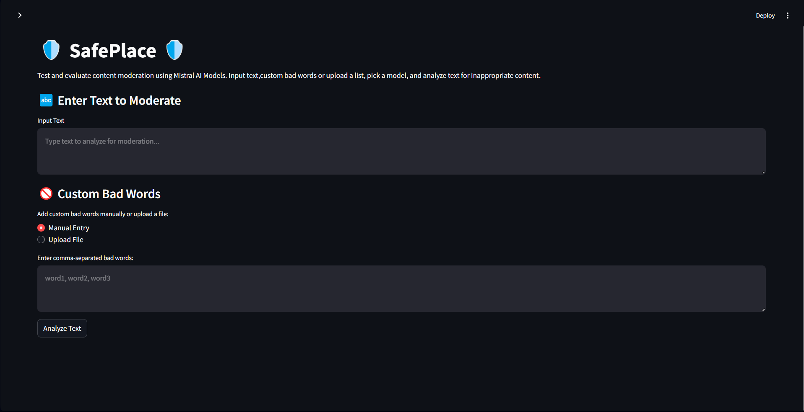
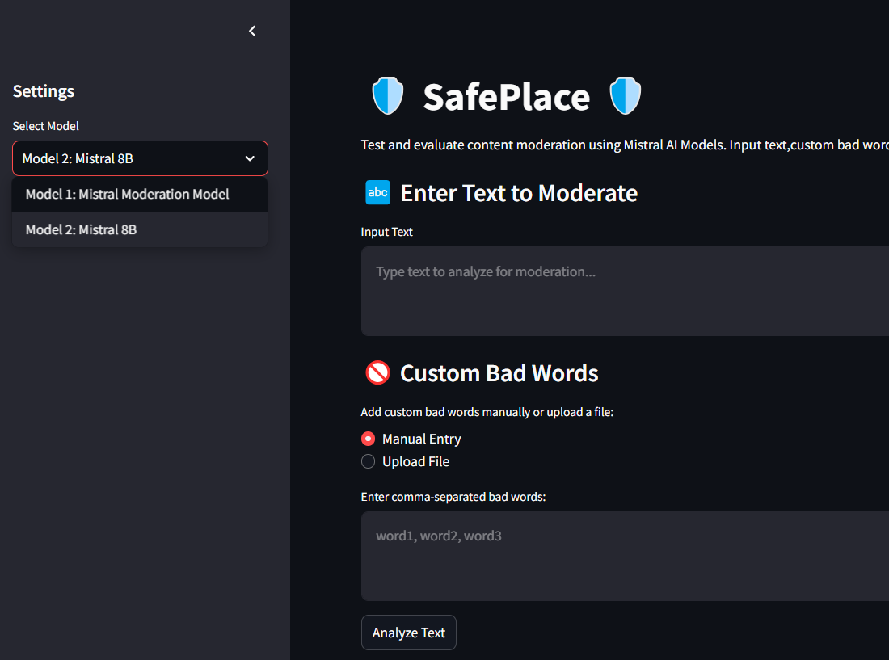

# SafePlace 
#### To make the internet a Safer Place.

A simple content moderation project built with Mistral models for assessing text content across several categories:
- sexual content
- hate and discrimination
- violence and threats
- dangerous and criminal content
- selfharm content
- health advice
- financial advice
- law advice
- PII: Personal Identifiable Information

## Project Structure


The project is divided into two folders:

- **Frontend**: Contains the user interface and client-side logic.
- **Backend**: Contains server-side logic, API endpoints, and integration with Mistral models.

---

## Screenshots




*Screenshot of the UI.*


*Screenshot showing moderation results.*

---

## Setup and Installation

### Prerequisites
 **Install dependencies**:
   ```bash
   pip install -r requirements.txt
   ```


### Backend

1. **Navigate to the backend folder**:
   ```bash
   cd backend
   ```


3. **Set up environment variables**:
   - Create a `.env` file with the necessary API key.
   ```
   MISTRAL_API_KEY=***************
   ```

4. **Run the backend server**:
   ```bash
   python -m uvicorn main:app --host 127.0.0.1 --port 8001 --reload
   ```

### Frontend

1. **Navigate to the frontend folder**:
   ```bash
   cd frontend
   ```

3. **Start the frontend server**:
   ```bash
   streamlit run main.py
   ```

*Open the frontend interface in your browser: http://localhost:8501*
